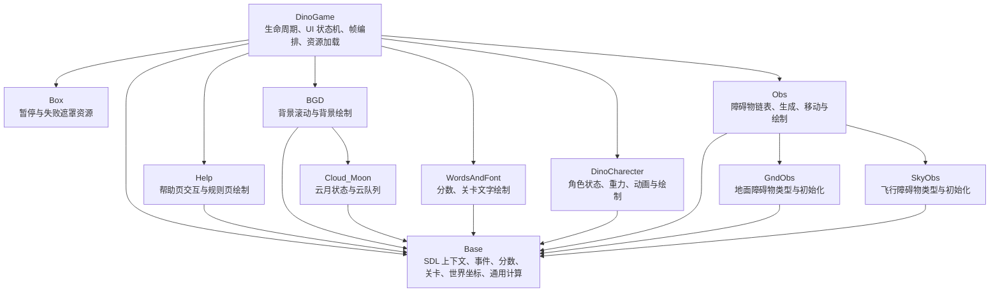
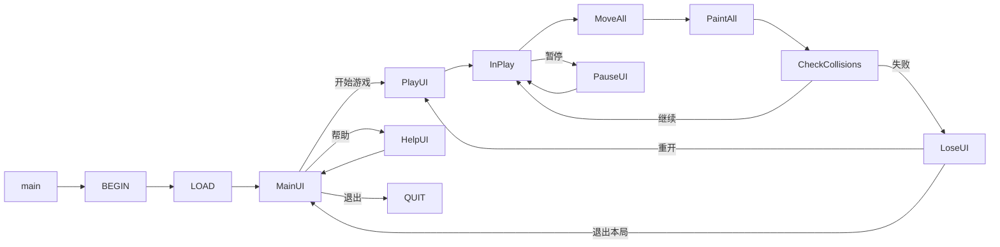

# HomeWork-LittleDino 架构设计

## 设计边界

本文根据现有源码恢复模块职责，并作为本次形式拆分的依据。

- `DinoGame.c` 继续是唯一的应用编排入口：负责初始化、资源加载、UI 状态机、主循环和退出清理。
- 各功能模块继续通过现有的共享状态协作；本次不调整状态机、坐标计算、碰撞、资源路径或游戏规则。
- 资源仍由 `LOAD` 统一创建、由 `QUIT` 统一释放，只是资源变量的定义移动到所属模块的 `.c` 文件。

## 模块图

## 主流程

游戏帧内的职责保持为：`MoveAll` 依次调用背景、障碍物和角色移动；`PaintAll` 依次绘制背景、障碍物、文字、角色和按条件显示的主菜单。碰撞判断仍由 `DinoGame.c` 读取 `Obs`、角色和障碍物模块暴露的状态完成。

## 编译单元边界

| 模块 | 拆分后的文件 | 职责 |
| --- | --- | --- |
| 基础设施 | `Base.h` / `Base.c` | SDL 共享状态、游戏基础状态和通用计算函数 |
| 覆盖层资源 | `Box.h` / `Box.c` | 暂停、失败和白色遮罩的资源状态 |
| 云月 | `Cloud_Moon.h` / `Cloud_Moon.c` | 云队列、月亮和相关状态 |
| 背景 | `BGD.h` / `BGD.c` | 背景滚动和背景绘制 |
| 角色 | `DinoCharecter.h` / `DinoCharecter.c` | 角色状态、运动和绘制 |
| 地面障碍物 | `GndObs.h` / `GndObs.c` | 地面障碍物类型、资源状态和初始化 |
| 飞行障碍物 | `SkyObs.h` / `SkyObs.c` | 飞行障碍物类型、资源状态和初始化 |
| 障碍物管理 | `Obs.h` / `Obs.c` | 链表、生成、移动和绘制 |
| 帮助页 | `Help.h` / `Help.c` | 帮助页翻页和绘制 |
| 文字 | `WordsAndFont.h` / `WordsAndFont.c` | 分数和关卡文字绘制 |
| 应用编排 | `DinoGame.h` / `DinoGame.c` | 生命周期、UI、资源加载、碰撞与帧编排 |

## 本次拆分规则

1. `.h` 文件只保留宏、类型、`extern` 变量声明和函数声明。
2. 原有全局变量的定义及函数体移动到同名 `.c` 文件，初始值和函数内容不改变。
3. 每个 `.c` 文件只包含自身头文件及它实际需要的模块头文件，使其可作为独立编译单元。
4. 不修复任何既有逻辑问题；已有的状态、控制流和资源生命周期保持原样。

## 多个 `.c` 文件如何参与编译

C 编译器可以把多个 `.c` 文件分别编译为目标文件，再在链接阶段合成一个可执行程序。拆分后，构建系统只需要将 `src` 下的所有 `.c` 文件列入同一个目标即可；不要求把实现塞进头文件。

根目录的 `CMakeLists.txt` 显式列出这 11 个 `.c` 文件，并通过 `find_package` 连接 SDL2、SDL2_image 和 SDL2_ttf 的 CMake target。构建完成后会将 `src/image`、`src/font` 和 `src/data` 复制到可执行文件目录，使资源路径仍保持原有相对布局。

## 本次验证状态

- 已静态确认：所有模块实现位于 11 个 `.c` 文件中；头文件不再包含函数体，变量通过 `extern` 声明共享。
- 先前的 MinGW 运行时虽有 SDL DLL、库和 CMake 配置，却缺少 SDL 开发头文件，不能作为当前构建工具链。
- 已使用完整的 MSYS2 MINGW64 环境验证构建；其中包含 GCC 16.1.0、SDL2、SDL2_image 和 SDL2_ttf 的头文件、库和 CMake package config。
- 已使用 CMake 3.29、Ninja、新 MINGW64 GCC，以及指向该 MINGW64 前缀的 `CMAKE_PREFIX_PATH` 成功配置并编译 `build\DinoGame.exe`；11 个源文件均被编译和链接，资源目录已复制到 `build`。
- 已进行增量构建检查，Ninja 报告无待执行工作。未运行游戏，运行时行为、资源错误路径和既有逻辑缺陷仍未验证。
